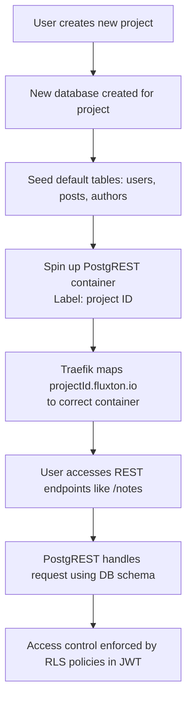

### What are dynamic REST endpoints?
Fluxton creates dynamic endpoints for your projects and tables. These enable you to have simple endpoints you update and access your data. For example, when you create a new project, you'll get a unique project URL looking like `https://<project-id>.fluxton.io`. All the tables you create after become available as CRUD endpoints. If you created a table called `notes`, it will become available as `https://<project-id>.fluxton.io/notes`. You can then list, view, create, update, and delete notes using the standard REST API methods (GET, POST, PUT, DELETE) on that URL. Fluxton handles the routing and data management for you.

### How do dynamic REST endpoints work?
