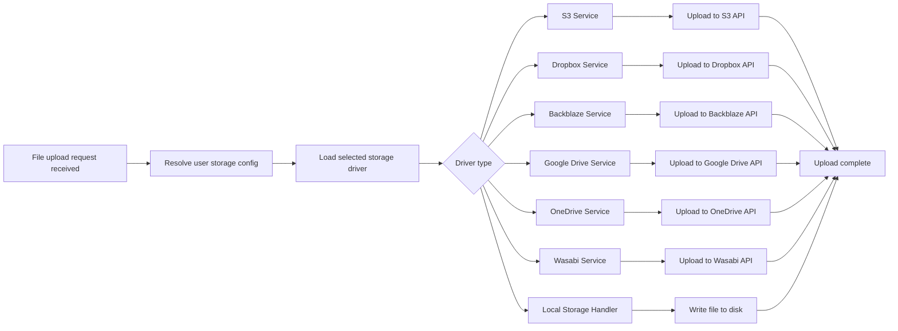

### What is storage?
A backend system needs storage. Your app may have profile pictures, covers, and other files. You need to store them somewhere. You can use a cloud storage service like AWS S3, Google Cloud Storage, or Azure Blob Storage. You can also use a local file system or a database to store files. Fluxton handles this for you.

You have several supported storage drivers to choose from. These are:

- Local
- S3
- Dropbox
- Backblaze

### How storage works?
You can configure driver of your choice. Fluxton takes care of rest. The result endpoints for listing, creating, updating, deleting containers and files are the same for all drivers. You can use any driver you want. 

